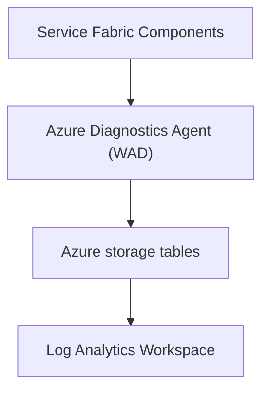

# Standard SKU Service Fabric managed cluster, 1 node type with Log Analytics enabled

<a href="https://portal.azure.com/#create/Microsoft.Template/uri/https%3A%2F%2Fraw.githubusercontent.com%2FAzure-Samples%2Fservice-fabric-cluster-templates%2Fmaster%2FSF-Managed-Standard-SKU-1-NT-AzureMonitor%2Fazuredeploy.json" target="_blank">
    
</a>
<a href="http://armviz.io/#/?load=https%3A%2F%2Fraw.githubusercontent.com%2FAzure-Samples%2Fservice-fabric-cluster-templates%2Fmaster%2FSF-Managed-Standard-SKU-1-NT-AzureMonitor%2Fazuredeploy.json" target="_blank">
    
</a>

This template allows you to deploy a Service Fabric managed cluster using the *Standard* SKU. This cluster contains a single node type running *Windows Server 2019 Datacenter* on a *Standard_D2s_v3* size virtual machine scale set with Log Analytics enabled. Windows Azure Diagnostics (WAD) currently provides the most comprehensive level of monitoring that can cover: events, counters, Event Tracing for Windows (ETW) as well as other information. A WAD template example is located here: [SF-Managed-Standard-SKU-1-NT-WAD](../SF-Managed-Standard-SKU-1-NT-WAD). See [Resources](#resources) for additional information.

## Log Analytics ETW Configuration flow

Log Analytics can query Windows Event Logs and Performance counters directly using a centralized configuration in Azure configured in Azure portal. ETW can be queried indirectly by using WAD to configure and upload ETW events to configured table storage account, Application Insights, or Event Hub as examples. See [Collecting Event Tracing for Windows (ETW) Events for analysis Azure Monitor Logs](https://docs.microsoft.com/azure/azure-monitor/agents/data-sources-event-tracing-windows) and [SF-Managed-Standard-SKU-1-NT-WAD Readme](../SF-Managed-Standard-SKU-1-NT-WAD/README.md)



## Performance Counter configuration

See [Collect Windows and Linux performance data sources with Log Analytics agent](https://docs.microsoft.com/azure/azure-monitor/agents/data-sources-performance-counters) for detailed configuration information for windows event log configuration.

Add desired counter names in the Log Analytics workspace 'Agents Configuration' blade. Below is a list of common non Service Fabric specific counters:

```
LogicalDisk(*)\% Free Space
Memory(*)\Available MBytes
Memory(*)\Pages/sec
Paging File(*)\% Usage
PhysicalDisk(*)\Current Disk Queue Length
Process(*)\Handle Count
Process(*)\Private Bytes
Process(*)\Thread Count
Processor(*)\% Processor Time
TCPv4(*)\Connections Established
TCPv4(*)\Segments Received/sec
TCPv4(*)\Segments Retransmitted/sec
TCPv4(*)\Segments Sent/sec

```


## Windows Event log configuration

See [Collect Windows event log data sources with Log Analytics agent](https://docs.microsoft.com/azure/azure-monitor/agents/data-sources-windows-events) for detailed configuration information for windows event log configuration.

### Service Fabric Specific Event Logs

Service Fabric Event logs will not be pre-populated in the drop down list and need to be manually entered. Add desired event log names in the Log Analytics workspace 'Agents Configuration' blade. The following lists the available Service Fabric specific event logs:

```
Microsoft-ServiceFabric/Operational
Microsoft-ServiceFabric/Admin
Microsoft-ServiceFabric/Audit
```


## Use Powershell to deploy your cluster

Go through the process of creating the cluster as described in [Creating Service Fabric Cluster via arm](https://docs.microsoft.com/azure/service-fabric/service-fabric-cluster-creation-via-arm)

## Resources

For more info, see:

- [Service Fabric managed cluster overview](https://docs.microsoft.com/azure/service-fabric/overview-managed-cluster) for details on managed clusters.

- [Service Fabric managed cluster template format](https://docs.microsoft.com/azure/templates/microsoft.servicefabric/2021-05-01/managedclusters) for more details on modifying this ARM template to meet your requirements.

- [Overview of Azure Monitor agents](https://docs.microsoft.com/azure/azure-monitor/agents/agents-overview) for a summary of different monitoring agents available and capabilities.

- [Log Analytics agent overview](https://docs.microsoft.com/en-us/azure/azure-monitor/agents/log-analytics-agent). 

- [Log Analytics virtual machine extension for Windows](https://docs.microsoft.com/azure/virtual-machines/extensions/oms-windows) for detailed information about the Log Analytics extension for Windows.

- [Log Analytics virtual machine extension for Linux](https://docs.microsoft.com/azure/virtual-machines/extensions/oms-linux) for detailed information about the Log Analytics extension for Linux.

- [Troubleshooting the Log Analytics VM extension in Azure Monitor](https://docs.microsoft.com/azure/azure-monitor/visualize/vmext-troubleshoot) for steps to troubleshoot Log Analytics extension.
